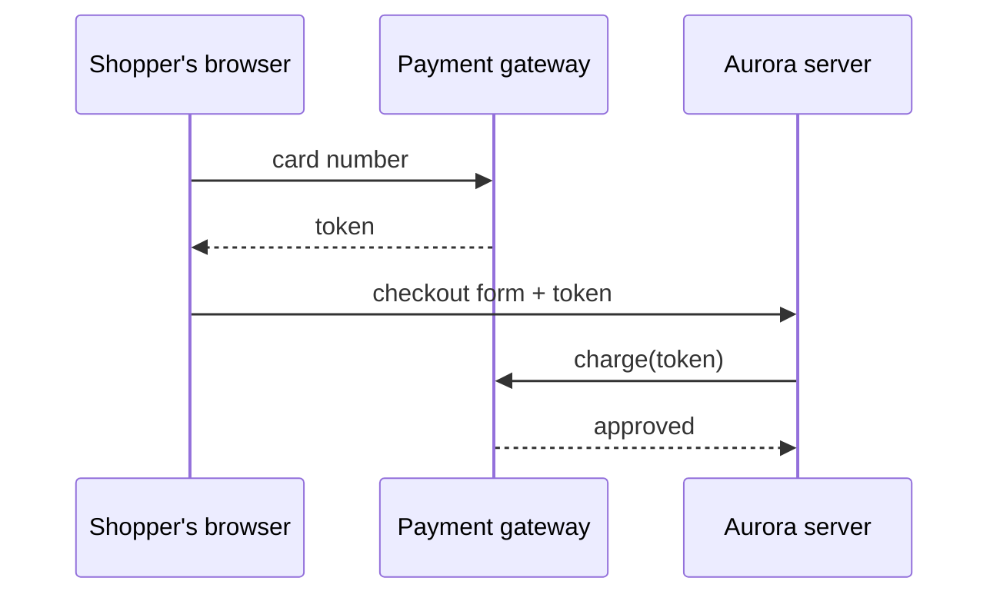

# How checkout tokenization works

## Lesson

When a shopper types a card number into Aurora's checkout, that number never touches your server. Instead, the browser sends it straight to the payment gateway, which replies with a **token** — a meaningless stand-in string. This swap is called [[Aurora/_glossary#Tokenization|tokenization]].

`src/Checkout/TokenizeHandler.php` receives only that token. It attaches the token to the order and passes it to `src/Api/GatewayClient.php`, which asks the gateway to charge the card the token represents.

Why go to this trouble? Because any system that stores or transmits real card numbers falls under strict security rules. Keeping card numbers out of Aurora entirely keeps the plugin inside a small [[Aurora/_glossary#PCI Scope|PCI scope]].

One more safeguard: `GatewayClient` sends a unique key with each charge request, so if the network drops and the request is retried, the gateway charges the card once, not twice. That retry-safe property is [[Aurora/_glossary#Idempotency|idempotency]].

## Files

- `src/Checkout/TokenizeHandler.php` @ `a1b2c3d`
- `src/Api/GatewayClient.php` @ `a1b2c3d`

## Sources

- [Idempotent — MDN Glossary](https://developer.mozilla.org/en-US/docs/Glossary/Idempotent)

## Comprehension

| # | Question | Result |
|---|---|---|
| 1 | Where does the real card number go, and what does the server see instead? | Correct |
| 2 | Why does keeping card numbers out of the server matter? | Correct |
| 3 | What stops a retried charge request from double-charging the card? | Correct |

Score: 3/3
