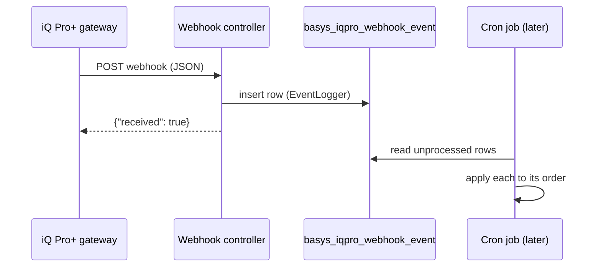

# Manual test — Task 2.1 (teach core, intro depth)

Test setup (2026-07-09):

- **Real target file:** `Controller/Webhook/Index.php` of the `Basys_IQProPayment` Magento plugin (`C:\laragon\www\magento\app\code\Basys\IQProPayment\`). Also read to verify claims: `Model/Webhook/EventLogger.php` (full), `Cron/ProcessWebhookEvents.php` (docblock + head), `etc/frontend/routes.xml` (route id/frontName).
- **Fixture:** vault glossary for project `IQProPayment` seeded with one previously-taught concept, **Webhooks** — the DOD requires the lesson to wiki-link it instead of re-teaching.
- **Depth:** `intro` (config default). **Sources:** none fetched — simple code walkthrough (sources.md rule: external material never by default). **Commit:** `unversioned` (plugin folder is not a git repository — verified with `git rev-parse` in both candidate locations).
- The teacher-subagent role was played by the session model (subagent not installed as an agent type in this dev session); the lesson follows `agents/alexandria-teacher.md`'s contract verbatim.

The skill's output follows, unedited.

---

**Lesson: What happens when the payment gateway calls your store** — `IQProPayment` · intro depth

When something happens to a payment after checkout — a settlement, a refund, a chargeback — the iQ Pro+ gateway needs a way to tell your store about it. It does that using [[IQProPayment/_glossary#Webhooks|webhooks]], and `Controller/Webhook/Index.php` is the single door in the plugin where those messages arrive.

**What this file does.** Magento (the software your store runs on) maps the web address `POST /basys_iqpropayment/webhook/index` to this class — the address comes from the plugin's `routes.xml`, which registers `basys_iqpropayment` as a route the plugin owns. When the gateway sends a message to that address, Magento runs this class's `execute()` method. What `execute()` does is deliberately minimal, and the file's own comment says so: *"Phase 1, receive and log only."* It:

1. Reads the raw message body the gateway sent.
2. Unpacks the JSON into named pieces — a trace ID, what kind of event it is (`resourceType`, `subType`), which transaction and invoice it belongs to, its status, and when it happened. Each piece is trimmed to at most 64 characters by the little `str()` helper, and anything malformed simply becomes empty rather than an error.
3. Hands those pieces, plus the untouched original message, to `EventLogger`, which inserts one row into the database table `basys_iqpro_webhook_event` — that's the entire `EventLogger` class, a single INSERT.
4. Replies `{"received": true}` — an "I got it" receipt — **no matter what**. Even if step 3 blows up, the error is logged and the receipt still goes out.

**Why always say "got it"?** Gateways redeliver webhooks they think got lost. If your store answered with an error, iQ Pro+ would keep retrying — the code comments call it a "retry storm." Acknowledging immediately, every time, keeps the gateway calm; the message is safe in the database either way.

**Where's the actual order update?** Not here — and that's the architecture lesson in this file. The controller only *receives*; a separate scheduled job (`Cron/ProcessWebhookEvents.php`) later reads unprocessed rows from that same table and applies each one to its order. Splitting "receive it fast" from "process it carefully" means a slow order update can never make the gateway time out and redeliver. That two-step shape is deferred processing.

**One odd-looking detail.** The class implements `CsrfAwareActionInterface` and returns "yes, valid" from `validateForCsrf()` without checking anything. Magento normally rejects POSTs that don't carry a special token proving they came from a real user's browser session — a defense called CSRF protection. The gateway is a machine, not a browser; it has no session and no token, so this endpoint explicitly opts out. The file's docblock is honest about the trade-off: signature verification (proving the message really came from iQ Pro+) is "not yet" implemented, so right now this door trusts its callers.

---
**Save this lesson?** Say "save" and alexandria-librarian will file it in your library (concepts confirmed with you first).
**Draft concepts this session:** [[IQProPayment/_glossary#Webhooks|Webhooks]], Deferred Processing, CSRF Protection
