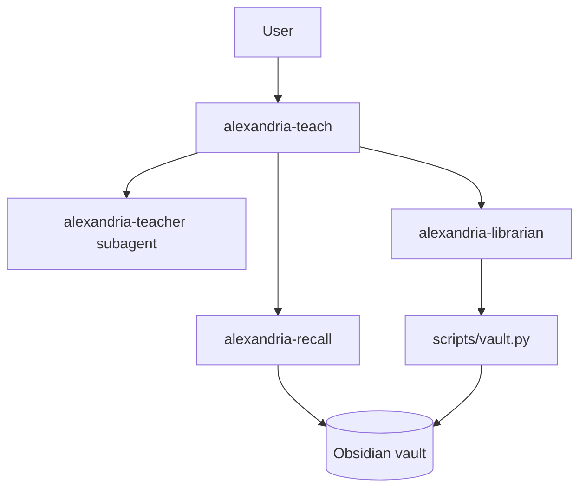
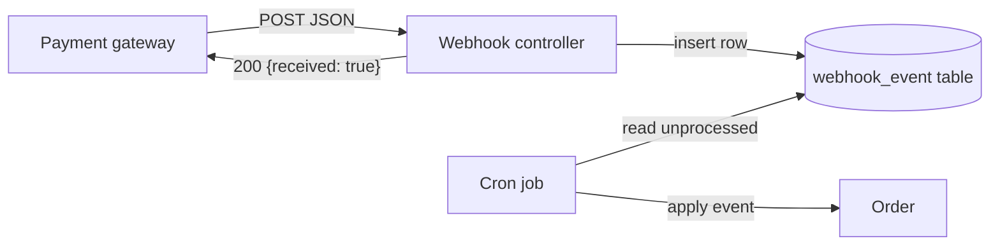
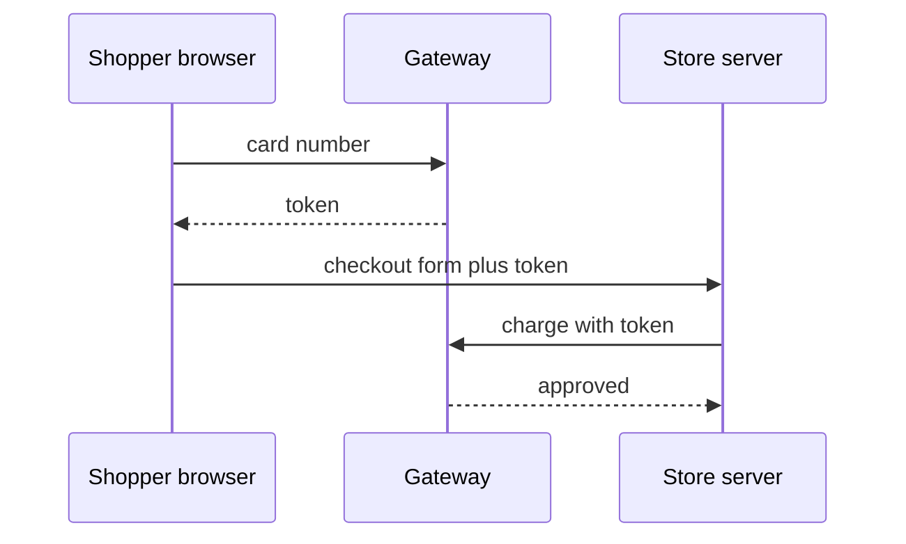
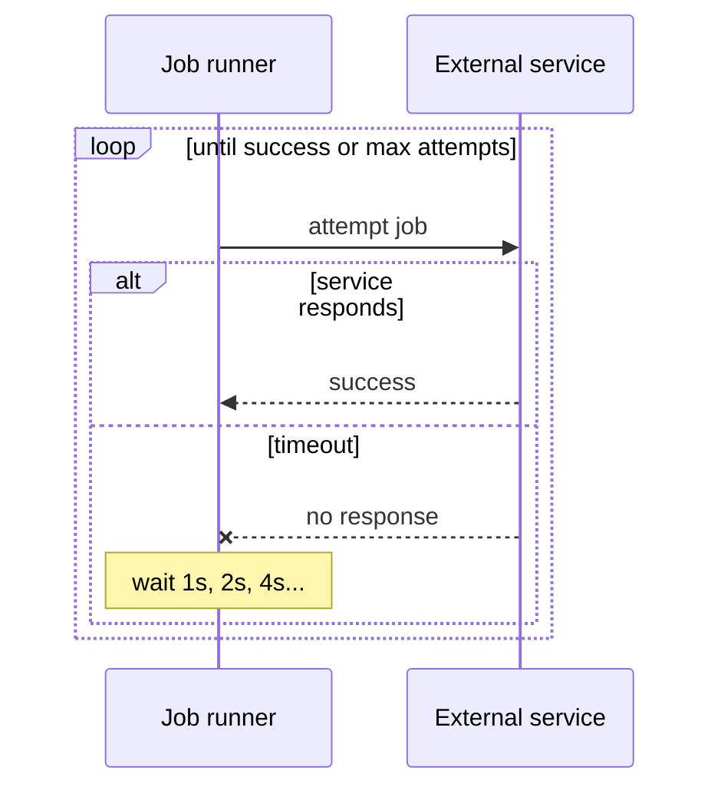
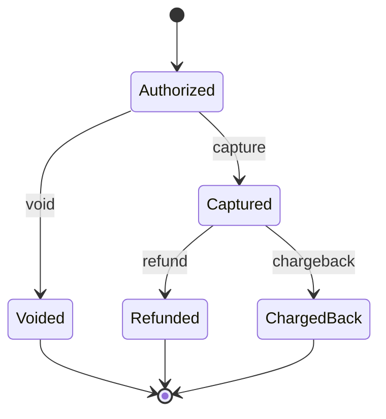
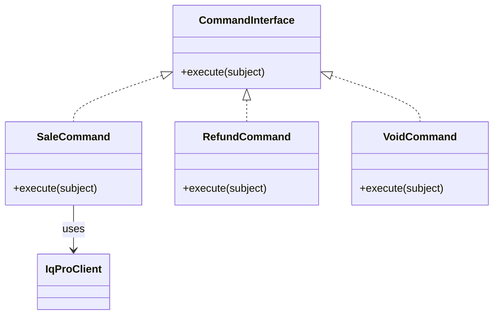
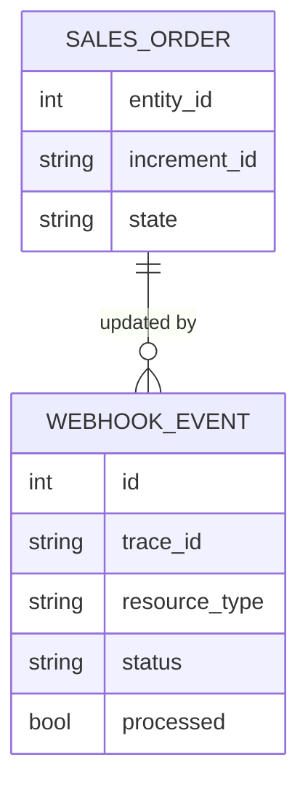
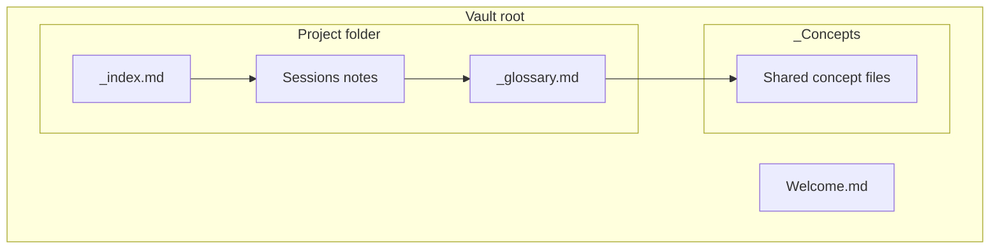
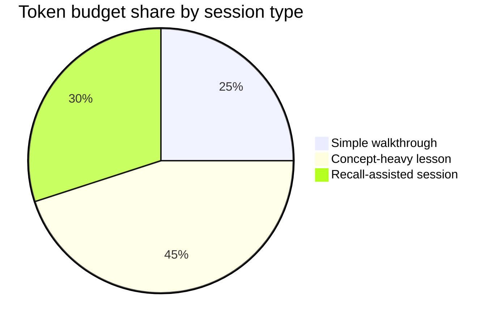
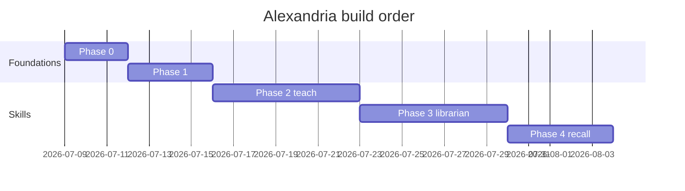

# Manual test — Task 2.4 (10 varied Mermaid diagrams for Obsidian rendering)

Open this file in Obsidian (reading or live-preview mode). **Pass = all 10 diagrams render with no "Syntax error" box, in both light and dark theme.** Each diagram is the kind `alexandria-teach` would emit for the named explanation, and each follows every constraint in `references/diagrams.md`.

Machine pre-check (2026-07-09): all 10 blocks extracted and rendered to SVG by `@mermaid-js/mermaid-cli` 11.16.0 with zero parse errors. The Obsidian visual pass (this file, both themes) is the remaining DOD step.

## 1. Architecture — the Alexandria suite (flowchart TD)

## 2. Data flow — webhook receive-then-process (flowchart LR)

## 3. Call sequence — checkout tokenization (sequenceDiagram)

## 4. Call sequence with branches — retry with backoff (sequenceDiagram, alt/loop)

## 5. State machine — payment lifecycle (stateDiagram-v2)

## 6. Class relations — gateway commands (classDiagram)

## 7. Data model — webhook events and orders (erDiagram)

## 8. Grouped architecture — vault layout (flowchart TD, subgraphs)

## 9. Proportions — token budget by session type (pie)

## 10. Schedule — build phases (gantt)

---

## Syntax patterns deliberately avoided, and why

| Avoided | Why |
|---|---|
| `%%{init: {...}}%%` directives, `style`/`classDef`/`linkStyle` | Fights Obsidian's light/dark theming — renders unreadable in one of the two modes |
| Unquoted labels with `( ) { } : ,` | Parse error in several Mermaid versions — quoted form used everywhere (diagrams 1, 2) |
| HTML in labels (` `, `<b>`) | Inconsistent across Mermaid versions/sanitizers; short labels instead |
| A node ID named `end` | Reserved word in flowchart/sequence blocks — breaks the parser |
| `click` handlers, Font Awesome `fa:fa-*` icons | Interactivity and icon fonts are not available in Obsidian's Mermaid sandbox |
| `mindmap`, `timeline`, `quadrantChart`, `sankey`, `xychart`, `block-beta` | Newer diagram types; Obsidian's bundled Mermaid may predate them — silent hard failure |
| Legacy `stateDiagram` (v1) and bare `graph` | v2/flowchart are the maintained grammars with better Obsidian rendering |
| `autonumber` in sequence diagrams | Adds step numbers the prose doesn't reference; noise |
| Trailing semicolons, multi-statement lines | Version-sensitive parsing; one statement per line throughout |
